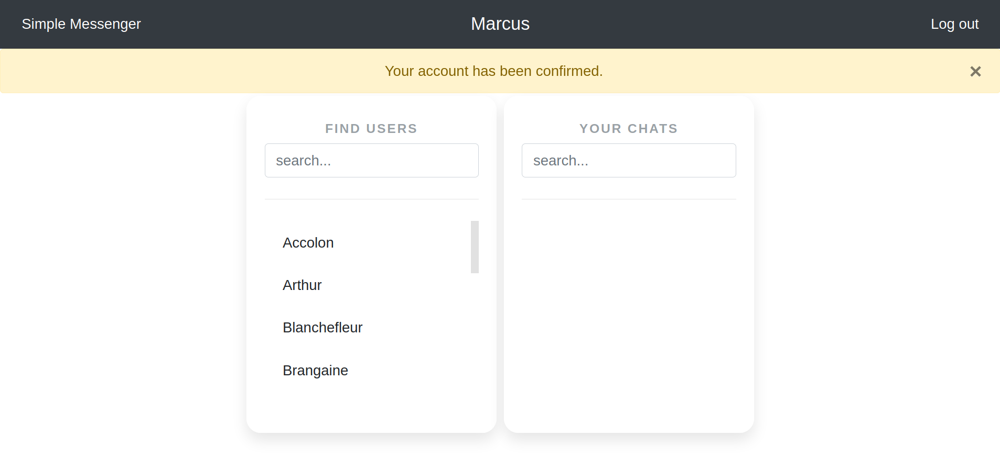
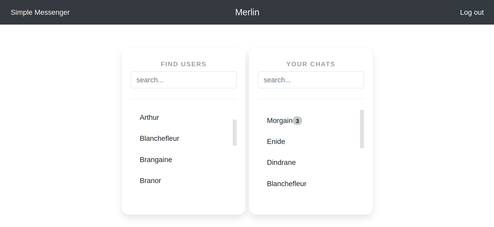

[](https://tldrlegal.com/license/mit-license)
<br>

# Simple Messenger
A client-server messenger built with ```Flask```.<br>
It uses ```WebSocket API```<br> 
(```flask-socketio``` for the server, ```socket.io``` for the client, ```gevent``` as a transport)<br> 
and features a tiny REST API.<br>
```PostgreSQL``` or ```sqlite3``` can be used.<br>
Email sending is implemented using Celery with Redis as a message broker.
The web interface looks okay in ```Firefox 78.0.2```, not so much in ```Chromium 84.0.4147.89```.<br>
Other browsers have not been tested.

<details>
  
 <summary> 
    Database schema
  </summary>
  
  <br>
  
  
  <i>Made using <a href="https://pgmodeler.io/">pgmodeler</a></i> 

</details>

<details>

  <summary>
      Screenshots
  </summary>
    
  <br>
    
  
  <i>Registration page</i>
  
<br>

  
  <i>After registration, the user is automatically logged in but stays unconfirmed - they have to check the inbox and follow the provided link </i> 
  
<br>

  
  <i>Confirmation is completed</i>
  
<br>

  
  <i>Logged out</i>
  
<br>

  
  <i>Wrong user data</i>
  
<br>

  
  <i>Main page</i>
  
<br>

  
  <i>Main page, several users selected</i>
  
<br>

  
  <i>Main page, 3 unread messages</i>
  
<br>

  
  <i>Main page, chat selected</i>
  
<br>

  
  <i>Main page, users and chats are filtered</i>
  
<br>

  
  <i>Main page, users and chats filtered, no chats found</i>
  
<br>

  
  <i>Generic error page</i>   
    
</details>

<details>
  
  <summary>
    Installation
  </summary>
  
  <br>

  The easiest way to run the app is to create a Docker image and then run it in a container.<br>
  If you have a Debian based system (Ubuntu, Mint...), the following steps should work<br>
  (tested on ```Ubuntu 20.04 LTS``` with ```docker.io 19.03.8``` installed):<br>
  - clone the repository, navigate to the project directory and make ```install.sh``` executable
  ```sh
  $ git clone https://github.com/96tm/simple-messenger.git; cd simple-messenger; chmod +x install.sh
  ```
  - run the installation script 
  (replace ```MAIL_SERVER``` with an email server of your choice,
   ```EMAIL_ADDRESS``` with an account address on that server,
   ```EMAIL_PASSWORD``` with the account's password):<br>
  ```sh
  $ sudo ./install.sh "MAIL_SERVER" "EMAIL_ADDRESS" "EMAIL_PASSWORD"
  ```
  Now you can open the app at <a href="http://localhost:8888/auth/signup">localhost:8888/auth/signup</a> and register.<br>
  Or you can <a href="http://localhost:8888">log in</a> right away with one of the test email/password pairs:
  - email ```arthur@arthur.arthur```, password ```arthurarthur```;
  - email ```morgain@morgain.morgain```, password ```morgainmorgain```;
  - email ```merlin@merlin.merlin```, password ```merlinmerlin```.
 
 To uninstall the application, run the following:<br>
  ```sh
  $ chmod +x uninstall.sh; sudo ./uninstall.sh
  ```
  To remove the images:
  ```sh
  $ sudo docker image rm python:3.7-alpine
  $ sudo docker image rm redis
  $ sudo docker image rm postgres
  ```

</details>

<details>
  
 <summary> 
  REST API
 </summary>
 
 The following actions are available:
 - get a list of the authenticated user's chats
 ```/api/v1.0/chats```;
 - get a chat by id
 ```/api/v1.0/chats/1```;
 - get a list of messages in the chat
 ```/api/v1.0/chats/1/messages```;
 - get a message by the id from the chat
 ```/api/v1.0/chats/1/messages/1```;
 - send a message
 ```/api/v1.0/chats/1/messages/```.

 Sending a message requires a JSON object in the form 
 ```{"text" :"your_message_text"}```
 in the request.
 
</details>
